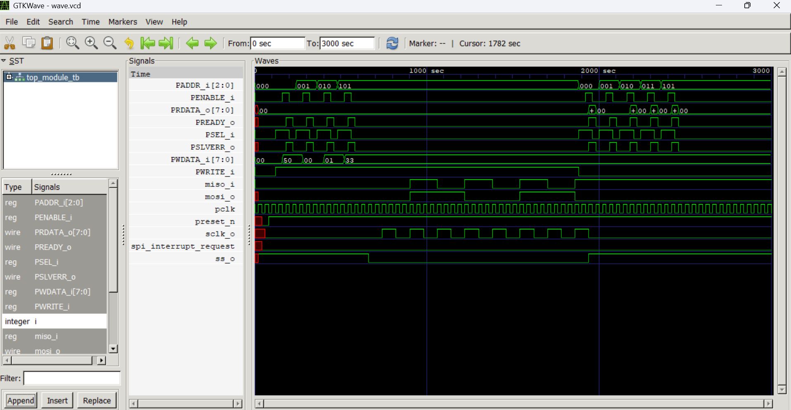

# APB-Based SPI RTL Design

## Overview

This project implements an **APB-based SPI interface using Verilog HDL**.

The design integrates an **AMBA APB slave interface** with SPI control logic to enable communication between an APB-based processor/system and an SPI peripheral.

The project includes individual RTL modules, dedicated testbenches, and a top-level testbench for functional simulation and verification.

## Features

* APB slave interface
* SPI data transfer logic
* Baud rate generation
* Shift register for serial data transfer
* Slave select/control logic
* Modular RTL design
* Individual module testbenches
* Top-level functional verification
* Waveform analysis using VCD and GTKWave

## Architecture

The major blocks in the design are:

                APB Interface
                     |
                     v
             +---------------+
             | APB Slave     |
             | Interface     |
             +-------+-------+
                     |
                     v
              +-------------+
              | SPI Control  |
              +------+------+
                     |
          +----------+----------+
          |          |          |
          v          v          v
      Shift      Baud Rate   Slave Select
     Register    Generator     Control
          |
          v
       SPI Data


## RTL Modules

### 1. APB Slave Interface

**File:** "rtl/apb_slave_interface.v"

Handles communication between the APB bus and the SPI control logic.

Main responsibilities:

* APB address decoding
* APB read/write operations
* Data transfer between APB and internal registers
* APB control signal handling

### 2. Baud Rate Generator

**File:** "rtl/baud_rate_generator.v"

Generates the clock/timing required for SPI data transmission based on the configured baud-rate division.

### 3. Shift Register

**File:** "rtl/shift_register.v"

Handles serial-to-parallel and/or parallel-to-serial data shifting required for SPI communication.

### 4. Slave Control Select

**File:** "rtl/slave_control_select.v"

Generates and controls the SPI slave-select signal used to select the required SPI slave device.

### 5. Top Module

**File:** "rtl/top_module.v"

Integrates all the individual RTL blocks into a complete APB-based SPI interface.

## Verification

The project contains dedicated testbenches for individual RTL modules as well as a top-level testbench.

### Testbenches

### Testbenches

```text
tb/
├── apb_slave_interface_tb.v
├── baud_rate_generator_tb.v
├── shift_register_tb.v
├── slave_control_select_tb.v
└── top_module_tb.v
```

Verification includes:

* Individual module simulation
* APB transaction testing
* SPI control testing
* Data shifting verification
* Baud-rate generation verification
* Slave-select control verification
* Top-level integration testing
* Waveform analysis

## Project Structure

```text
apb-based-spi-rtl/
│
├── rtl/
│   ├── apb_slave_interface.v
│   ├── baud_rate_generator.v
│   ├── shift_register.v
│   ├── slave_control_select.v
│   └── top_module.v
│
├── tb/
│   ├── apb_slave_interface_tb.v
│   ├── baud_rate_generator_tb.v
│   ├── shift_register_tb.v
│   ├── slave_control_select_tb.v
│   └── top_module_tb.v
│
├── .gitignore
└── README.md
```


## Tools Used

* **Verilog HDL**
* **Icarus Verilog**
* **GTKWave**
* **Visual Studio Code**
* **Git & GitHub**

## Simulation

### Compile the Top-Level Design

From the project root directory:

```powershell
iverilog -g2012 -s top_module_tb -o sim.vvp rtl\*.v tb\top_module_tb.v
```

### Run the Simulation

```powershell
vvp sim.vvp
```

### Generate Waveform

Add the following to the testbench if waveform generation is required:

```verilog
initial begin
    $dumpfile("top_module.vcd");
    $dumpvars(0, top_module_tb);
end
```

Then compile and run:

```powershell
iverilog -g2012 -s top_module_tb -o sim.vvp rtl\*.v tb\top_module_tb.v
vvp sim.vvp
```

### Open Waveform in GTKWave

```powershell
gtkwave top_module.vcd
```

## Why This Project?

This project demonstrates practical knowledge of:

* RTL design using Verilog HDL
* AMBA APB protocol concepts
* SPI communication
* Digital logic design
* Modular hardware architecture
* RTL integration
* Functional simulation
* Testbench development
* Waveform debugging

## Future Enhancements

Possible future improvements include:

* Support for configurable SPI modes (CPOL/CPHA)
* Configurable SPI data width
* Multiple SPI slave support
* APB register map documentation
* SystemVerilog-based verification
* Assertions for protocol checking
* Functional coverage
* UVM-based verification environment
* Synthesis and timing analysis

## Simulation Results

The APB-based SPI RTL design was functionally simulated using Icarus Verilog. The resulting waveforms were analyzed using GTKWave.

### Final Simulation Waveform



## Author

**TirumalasettyJahnavi**

B.Tech – Electronics and Communication Engineering

Interested in **RTL Design, VLSI, ASIC Design and Design Verification**.

## Repository

GitHub: **APB-Based SPI RTL Design**

[View the GitHub Repository](https://github.com/TirumalasettyJahnavi/apb-based-spi-rtl?utm_source=chatgpt.com)
